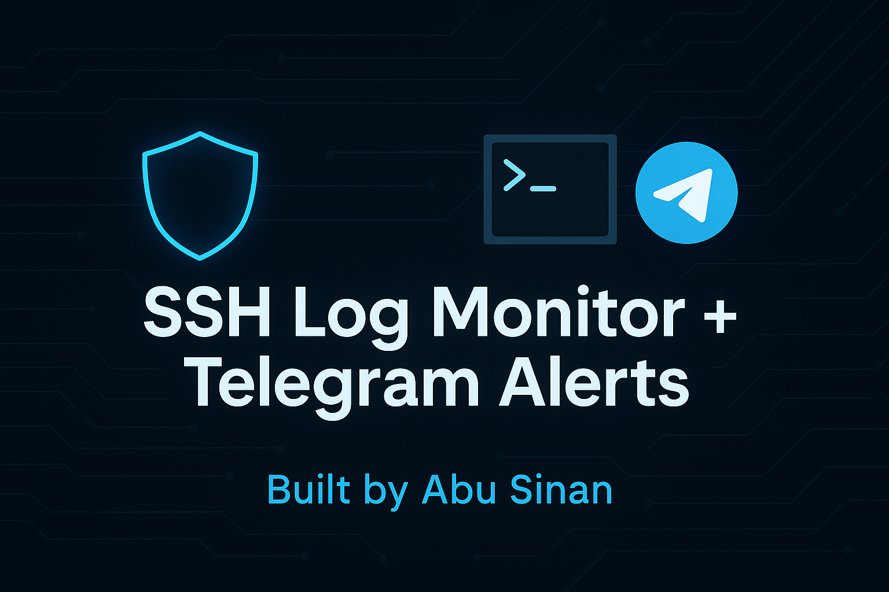

# 🛡️ SSH Log Monitor + Telegram Alerts

**A lightweight Python security tool** that monitors your Linux SSH logs (`/var/log/auth.log`) and instantly sends alerts to your Telegram bot when suspicious login attempts are detected — such as brute-force attacks or repeated failed passwords.



---

## 🚀 Why This Project?

SSH brute force attacks are one of the most common intrusion methods on public Linux servers. This tool helps you:
- Monitor SSH logs in real time
- Get alerts before attackers succeed
- Automate your security workflows
- Practice log parsing, automation, and alerting — all key cybersecurity skills

---

## 🧩 Features

- 🔍 Monitors `auth.log` for failed SSH login attempts
- 📲 Sends real-time Telegram alerts with IP and log details
- 🧠 Designed to be simple, portable, and fast
- 🔐 Optional IP auto-blocking with `iptables`
- ⚙️ Easy to run manually, via cron, or as a systemd service

---

## 📂 Project Structure
```
ssh-log-monitor-telegram/ ├── monitor.py           # Main script ├── config.json          # Telegram bot token + chat ID (template) ├── requirements.txt     # Python dependencies ├── assets/ │   └── thumbnail.png    # Project banner image └── README.md            # Documentation
```